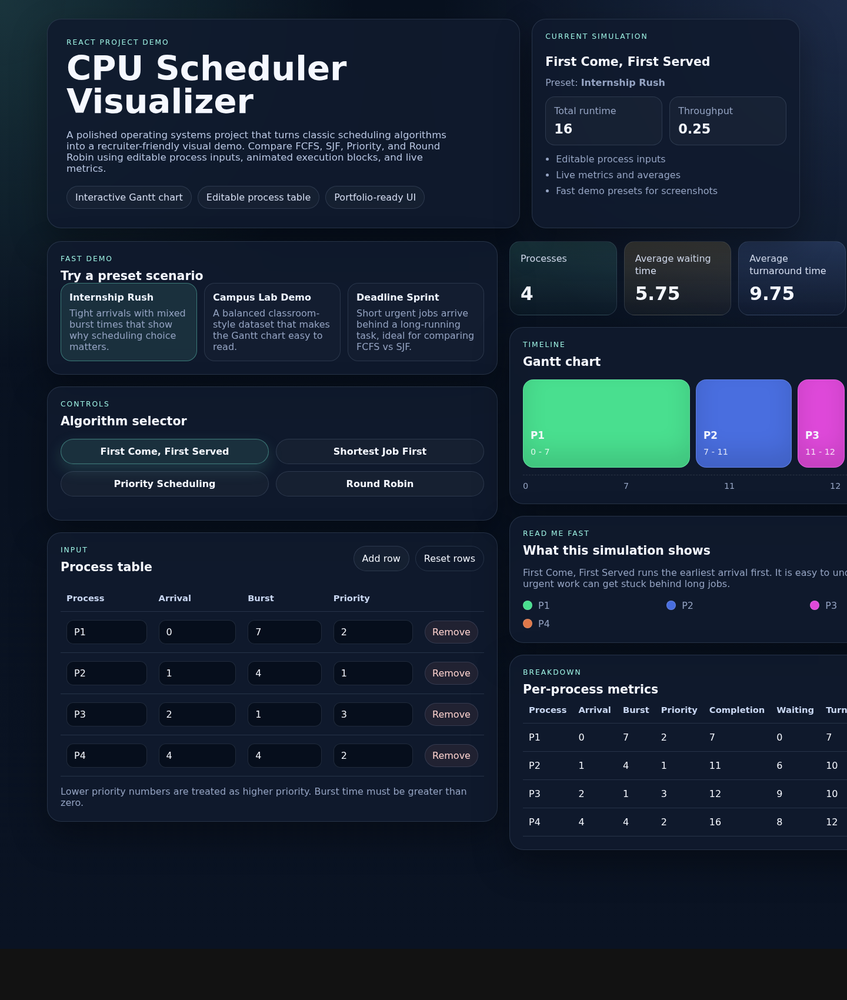

# CPU Scheduler Visualizer

A polished React project that visualizes classic CPU scheduling algorithms in a recruiter-friendly way.



## Features
- FCFS simulation
- Shortest Job First (non-preemptive)
- Priority Scheduling (non-preemptive)
- Round Robin with editable time quantum
- Editable process input table
- Built-in demo presets for fast demos
- Animated Gantt chart timeline
- Per-process metrics and average waiting, turnaround, and response times

## Why this is resume-worthy
This project turns operating systems concepts into an interactive product demo. It shows:
- algorithm implementation from scratch
- React state management and derived calculations
- data visualization and dashboard-style UI polish
- testing for both scheduling logic and interface behavior

## Tech stack
- React
- Vite
- Vitest
- Testing Library

## Run locally
```bash
npm install
npm run dev
```

## Test
```bash
npm test
```

## Build
```bash
npm run build
```

## Supported algorithms
- First Come, First Served
- Shortest Job First
- Priority Scheduling
- Round Robin
